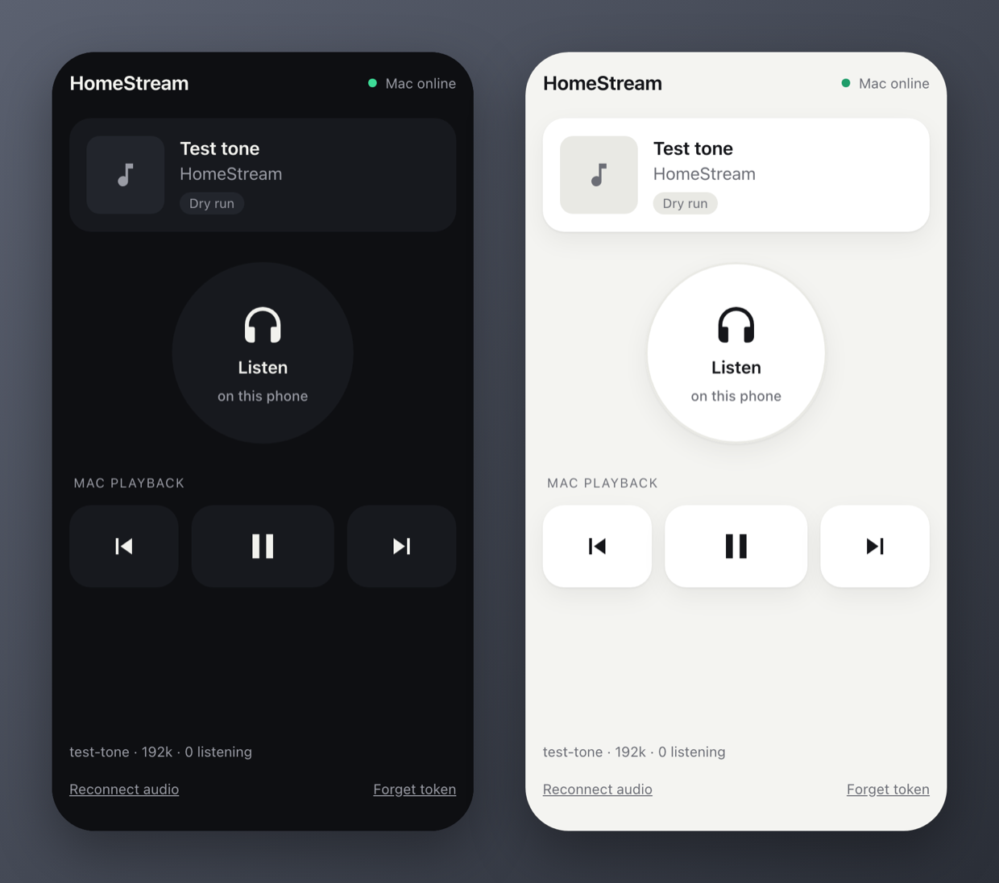

# HomeStream

[](https://github.com/orroschrysovalantis22/homestream/actions/workflows/ci.yml)
[](LICENSE)


[](https://github.com/sponsors/orroschrysovalantis22)

Listen to whatever your computer is playing from your phone, anywhere, and control it: play, pause, skip.

Play Spotify, YouTube or anything else on your Mac, Windows or Linux computer, and listen on your phone over Wi-Fi or mobile data, with the album art and play/pause/skip buttons, even on the lock screen.

<p align="center"></p>

* **Any phone, no app to install.** A web page you add to your Home Screen. Works on iPhone and Android, with the lock screen's buttons.
* **About half a second behind live,** so pressing ⏭ feels instant.
* **Works with whatever is playing:** any app, or any website in any browser (Chrome, Firefox, Brave, Safari…) with whatever extensions you use. HomeStream relays exactly what your computer plays, so if your browser blocks ads (as Brave does), you won't hear them on your phone either. Album art, title and controls come from your computer's own media controls.
* **No terminal needed.** HomeStream lives in your menu bar or system tray and can start when you log in.
* **Private.** Nothing is opened up to the internet; only your own devices can connect.

## Get started

**1. Install Tailscale on your computer and your phone.** [Tailscale](https://tailscale.com/download) is a free app that connects your own devices privately, so your phone can reach your computer from anywhere. Sign in with the same account on both.

**2. Download HomeStream for your computer** from the [latest release](https://github.com/orroschrysovalantis22/homestream/releases/latest):

| Computer | Download | Also install |
|---|---|---|
| **macOS** 13+ (Apple Silicon) | `HomeStream-macOS.zip`: unzip, move HomeStream to Applications | [BlackHole 2ch](https://existential.audio/blackhole/), free. macOS can't record what's playing without it. Optional: `brew install media-control` for track info and controls with any app. |
| **Windows** 10/11 | `HomeStream-Windows.zip`: unzip, run `HomeStream.exe` | nothing |
| **Linux** (PulseAudio or PipeWire) | `HomeStream-Linux.tar.gz`: unpack, run `HomeStream` | `playerctl`, for controls (e.g. `sudo apt install playerctl`) |

The first time you open it (the apps aren't signed yet):
* **macOS:** right-click HomeStream → **Open** → **Open**. When macOS asks to use the **microphone**, allow it: that's how HomeStream hears BlackHole.
* **Windows:** if a blue SmartScreen box appears, **More info** → **Run anyway**. When Windows asks whether HomeStream may use the network, click **Allow**.

**3. Connect your phone.** HomeStream appears in your menu bar or system tray and opens a **Connect your phone** page. Scan its QR code with your phone's camera, then tap **Share → Add to Home Screen** (iPhone) or **⋮ → Add to Home screen** (Android). Play something on the computer and tap **Listen on this phone**.

That's it. Next time, just open HomeStream on your phone.

> **Windows status:** tested on Windows 11 in a virtual machine with the downloaded `HomeStream.exe`: clean audio, controls, the tray app and start at login. Not yet on a physical PC with Spotify; reports welcome.

## Troubleshooting

Run `homestream doctor` (or check the tray menu): it tests capture, controls and Tailscale and says what's wrong.

| Problem | Fix |
|---|---|
| The page asks for a token | Your phone isn't connecting through Tailscale. Switch Tailscale on in its app and reload. |
| The page doesn't load | Tailscale must be on for both devices, and the computer awake with HomeStream running. Type the number address shown on the Connect page (`100.x.y.z:8765`): browsers treat a bare name as a search. |
| Windows: the phone can't connect | You clicked Cancel when Windows asked about the network. Windows Security → Firewall & network protection → Allow an app through firewall → tick HomeStream. |
| No sound | macOS: allow the microphone permission, and check BlackHole is installed. Linux: `homestream doctor` should list a "Monitor of …". |
| No track info, or buttons do nothing | macOS: `brew install media-control`. Linux: install `playerctl`. |
| No sound on the Mac after a crash | Pick your speakers again in System Settings → Sound. |

## Run from source

```bash
git clone https://github.com/orroschrysovalantis22/homestream.git && cd homestream
./setup.sh                                           # macOS and Linux
powershell -ExecutionPolicy Bypass -File setup.ps1   # Windows
```

The setup script installs what's needed (Mac: BlackHole and media-control via Homebrew; Linux: playerctl; Windows: Python if missing), creates a Python environment in `.venv`, writes your settings with a random token, and offers to install Tailscale. Then start HomeStream:

```bash
.venv/bin/homestream tray          # in the menu bar / system tray (Windows: .venv\Scripts\homestream tray)
./scripts/start-relay.sh           # or in a terminal, with a QR code (Windows: scripts\start-relay.cmd)
```

## Technical details

For the curious and for contributors.

### How each computer captures and controls

| | Captures | Controls and track info |
|---|---|---|
| **macOS** | The BlackHole virtual device. HomeStream switches the sound output to it only while a phone is listening, and back to your speakers when it stops. | macOS Now Playing via `media-control`: any app. Without it: the Spotify app (AppleScript), or media keys (needs Accessibility). |
| **Windows** | What the speakers play (WASAPI loopback). No driver. | Global System Media Transport Controls: anything in the volume flyout. |
| **Linux** | The monitor of the default PulseAudio/PipeWire output. No driver. | MPRIS via `playerctl`: Spotify, Firefox, Chrome, VLC, mpv… |

**Hearing the music on the Mac too.** While a phone listens, the Mac's sound goes to BlackHole, so its speakers are quiet. To hear it on both, create a **Multi-Output Device** in Audio MIDI Setup (speakers + BlackHole), select it, and set `HOMESTREAM_AUTO_ROUTE=0`.

### Settings

Settings are `HOMESTREAM_*` variables in a settings file: `.env` in a source checkout, otherwise per user, e.g. `~/Library/Application Support/HomeStream/homestream.env`, `%APPDATA%\HomeStream\homestream.env` or `~/.config/homestream/homestream.env`. `homestream config` prints the path. The useful ones:

| Setting | Default | |
|---|---|---|
| `HOMESTREAM_AUDIO_DEVICE` | per OS | what to capture; `homestream doctor` lists what's available |
| `HOMESTREAM_PLAYER` | `auto` | per OS: `nowplaying`/`spotify`/`browser` (Mac), `mpris` (Linux), `windows`; `dryrun` for development |
| `HOMESTREAM_BITRATE` | `192k` | 192 kbps is about 86 MB per hour; `128k` is about 58 MB |
| `HOMESTREAM_TRUST_TAILSCALE` | `1` | `0` requires the token from everyone |
| `HOMESTREAM_TOKEN` | random | password for devices that aren't on Tailscale |
| `HOMESTREAM_PORT` | `8765` | |
| `HOMESTREAM_AUTO_ROUTE` | `1` | macOS: switch the output to BlackHole while a phone is listening |
| `HOMESTREAM_SNAPCAST` | `0` | also run a [Snapcast](https://github.com/badaix/snapcast) server (macOS/Linux) |

### How it works

```
 Computer                                                          Phone (anywhere)
┌──────────────────────────────────────────────────────┐          ┌──────────────────────────┐
│ any player ──► speakers / BlackHole                   │          │  one web page:           │
│                    │ capture (PortAudio/WASAPI/Pulse) │ Tailscale│   • live audio, ~0.5 s   │
│                    ▼                                  │ ◄──────► │   • artwork, title, time │
│ HomeStream: LAME → MP3 frames → /stream.mp3           │  private │   • ⏮ ⏯ ⏭, lock screen   │
│   /events (now playing) ◄── system media controls     │  network │   • Home Screen icon     │
└──────────────────────────────────────────────────────┘          └──────────────────────────┘
```

* **Capture and encoding** run in-process on a background thread: PCM from the OS's capture API, MP3 via LAME. The server cuts the stream into whole MP3 frames (24 ms each). A listener that falls behind loses whole frames, which play on cleanly, never half a frame, which would decode as noise. Capture only runs while someone listens.
* **Playback on the phone** uses Media Source Extensions (`ManagedMediaSource` on iPhone). The page fetches the stream itself and keeps about 0.5 s buffered. Left alone, iPhone Safari waits for about 5 s and stays that far behind. A dropped connection only restarts the fetch, so playback survives the phone being locked.
* **Now playing** is pushed to the page over server-sent events the moment the track changes.

### Security

* **Tailscale devices** get in without a password: only when both ends of the connection are Tailscale addresses, so a device on the local network can't pass itself off as one.
* **Everything else** needs the token: an `Authorization: Bearer <token>` header, or the cookie set when it's entered on the page. Links of the form `/#token=…` keep it in the URL fragment, which never reaches servers or logs.
* **Other websites can't press the buttons.** Browsers label requests sent by other sites, and HomeStream refuses those, so a web page open on your phone can't skip your music. (`curl` and other tools aren't affected.)
* The **Connect a phone** page (`/pair`) is only served to the computer's own browser.
* Don't port-forward 8765 to the internet; traffic is plain HTTP. For access beyond your tailnet, put HTTPS in front (`tailscale serve` / `funnel`).

### API

| Route | |
|---|---|
| `GET /` | the phone page |
| `GET /status`, `GET /events` | player, track, progress and stream state (once / pushed on change) |
| `POST /play` `/pause` `/toggle` `/next` `/prev` | playback control (409 with a reason if the player can't act) |
| `GET /stream.mp3?id=…` | live audio |
| `GET /stream-info?id=…` | when that connection's audio was captured, for measuring delay |
| `GET /artwork?v=…` | current album art |
| `GET /pair` | "Connect a phone" page (this computer only) |
| `POST /auth`, `POST /logout` | set / clear the token cookie |

```bash
curl -X POST http://100.x.y.z:8765/next                                     # from a device on your tailnet
curl -H "Authorization: Bearer $TOKEN" http://192.168.1.20:8765/status      # anywhere else
```

### Development

```bash
pip install -e ".[dev,tray]"
HOMESTREAM_AUDIO_DEVICE=test-tone HOMESTREAM_PLAYER=dryrun homestream start   # no audio hardware needed
python -m pytest                                                               # ~70 tests, ~10 s
tools/linux/test.sh        # Linux end to end in Docker: mpv → PulseAudio → HomeStream → clean stream + MPRIS
pyinstaller packaging/homestream.spec                                          # build the app for this OS
```

Add `?debug` to the page's address to see the measured delay. CI runs the tests on macOS, Linux and Windows, plus the Linux end-to-end test. Tagging `v*` builds and publishes the three apps.

**On real phone browsers.** iPhone Safari and Android Chrome behave differently from desktop browsers, so they're tested in the iOS Simulator and an Android emulator:
* `tools/harness.sh` starts a test server playing `test-signal`, a tone with a 1 kHz beep every second.
* Record what the simulated phone plays with `python -m homestream.capture --seconds 15 "BlackHole 2ch"` and check it with `tools/analyze_test_signal.py`. Clean means beeps 1000 ms apart and no gaps or noise.
* `tools/android.sh` drives the emulator, including the phone's media buttons and what its lock screen shows.

#### Layout

```
homestream/cli.py           the `homestream` command: start, serve, doctor, tray, config
homestream/server.py        web app: page, access rules, API, events, stream, /pair
homestream/audio.py         capture → LAME → MP3 frames → listeners
homestream/capture.py       per-OS capture (PortAudio, WASAPI loopback, PulseAudio monitor) and test signals
homestream/players/         per-OS now playing and controls (macos.py, linux.py, windows.py)
homestream/tray.py          menu bar / system tray app;  autostart.py: start at login per OS
homestream/system.py        keep awake, macOS output routing (macaudio.py), Tailscale and addresses
homestream/web/             the phone page (one file, no build step), /pair page, icons
packaging/                  PyInstaller recipe and app icons
tests/  tools/              tests; Linux, iPhone and Android test harnesses
```

## Support

HomeStream is free and open source. If it's useful to you, you can support its development on [GitHub Sponsors](https://github.com/sponsors/orroschrysovalantis22). Stars, bug reports and pull requests help too.

## License

MIT © Orros Chrysovalantis ([@orroschrysovalantis22](https://github.com/orroschrysovalantis22)), see [LICENSE](LICENSE). BlackHole, media-control, Snapcast and Tailscale are separate projects under their own licenses and aren't bundled.
